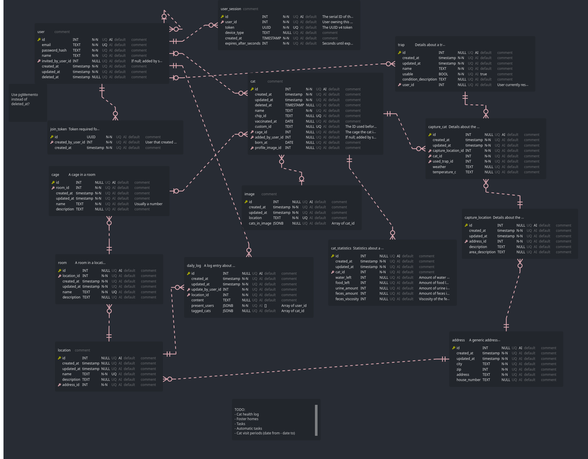

# Redd-dyra Backend
This contains a GraphQL API that talks with a PostgreSQL DB through some business logic.

## DB ERD
> The schema will be implemented as needed with Knex.js



## Development
### Commands
| Action | Command | Note |
|-|-|-|
| Install dependencies | `npm install` | |
| Start DB docker | `npm run db:start` | Requires Docker and Docker Compose |
| Run Knex.js commands | `npm run knex {command}` | Run `npm run knex -- --help` for info |
| Migrate to latest | `npm run knex migrate:latest` | Apply schema and all migrations to DB |
| Start dev server | `npm run dev` | |

### Knex.js
- Adding a new table
  1. Add table to Vuerd [[Github](https://github.com/vuerd/vuerd/) | [VSCode Extension](https://marketplace.visualstudio.com/items?itemName=dineug.vuerd-vscode)]
  2. Export all tables to [db-tables.d.ts](src/db/db-tables.d.ts)
  3. Run `npm run tool:fix-table-types`
  4. Assign the type to the tables interface in [knex-tables.d.ts](src/db/knex-tables.d.ts)
    ```ts
    interface Tables {
      ...
      // The interface key should be lowercase, the types are PascalCase
      {tablename}: Knex.CompositeTableType<
      // Base (Select, where, etc.)
      DB.{Tablename},
      // Insert
      Omit<DB.{Tablename}, DefaultOmit>
      >
    }
    ```
  5. Create a migration for it with `npm run migrate:make {migration name}`
